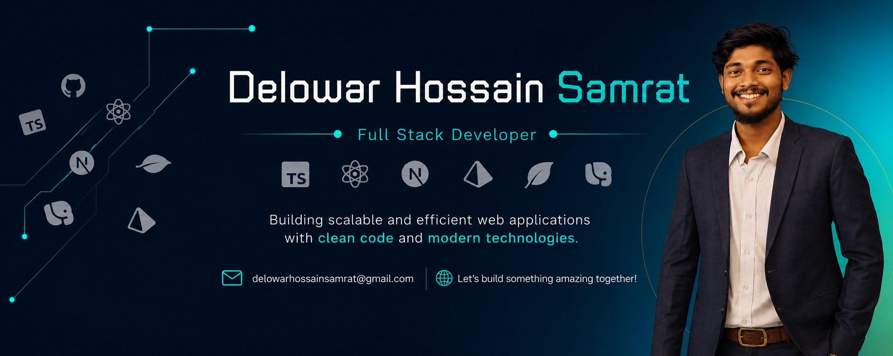

  

## Hi👋, I'm Delowar Hossain Samrat,

  

- 🔭 I’m currently working on Web Development Project
- 🌱 I’m currently learning Full Stack Web development
- 👯 I’m looking to collaborate on Web Development Project
- 🤔 I’m looking for help with Web Development
- 💬 Ask me about ...Web Development
- 📫 How to reach me: Google it "delowarhossainsamrat"
- 😄 Pronouns: He/Him
- ⚡ Fun fact: I Love Code
- 👋 About Me

Hi, I'm Delowar Hossain Samrat, a Computer Science & Engineering student and aspiring Full-Stack Web Developer from Bangladesh.

💻 I'm passionate about building modern, responsive, and user-friendly web applications. I’m currently improving my skills in HTML, CSS, JavaScript, React.js, Node.js, and backend development.

🚀 I enjoy learning new technologies, solving programming problems, and working on real-world projects. My goal is to become a skilled Software Engineer / Full-Stack Developer and contribute to meaningful projects.

🛠️ Technologies & Tools

- HTML5 | CSS3 | JavaScript
- React.js | Node.js | Express.js
- C | C++
- Git | GitHub
- MySQL / MongoDB
- Responsive Web Design

🎯 Currently

- 🌱 Learning Full-Stack Web Development
- 💡 Building personal & academic projects
- 📚 Improving problem-solving and programming skills
- 🚀 Preparing for a career in Software Engineering

“Always learning, always building.”

## 🌐 Socials:
    

# 💻 Tech Stack:
                           
# 📊 GitHub Stats:
 
 

## 🏆 GitHub Trophies

### ✍️ Random Dev Quote

### 🔝 Top Contributed Repo

---

<!-- Proudly created with GPRM ( https://gprm.itsvg.in ) -->
